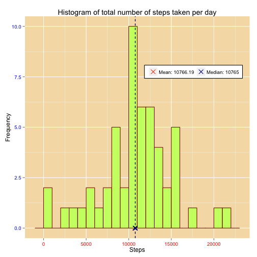

### Coursera Data Science Specialization course ###
###   Reproducible Research - Peer Assigment 1  ###
        SONEINT alias @Soc_Net_Intel
========================================================

**1. Introduction**

It is now possible to collect a large amount of data about personal movement 
using activity monitoring devices such as a [Fitbit](http://www.fitbit.com/fr), 
[Nike Fuelband](http://www.nike.com/us/en_us/c/nikeplus-fuelband), or 
[Jawbone Up](https://jawbone.com/up). These type of devices are part of the 
“quantified self” movement – a group of enthusiasts who take measurements about 
themselves regularly to improve their health, to find patterns in their behavior, 
or because they are tech geeks. But these data remain under-utilized both because 
the raw data are hard to obtain and there is a lack of statistical methods and 
software for processing and interpreting the data.

This assignment makes use of data from a personal activity monitoring device. 
This device collects data at 5 minute intervals through out the day. 
The data consists of two months of data from an anonymous individual collected 
during the months of October and November, 2012 and include the number of steps 
taken in 5 minute intervals each day.

**2. Data**

The data for this assignment can be downloaded from the course web site:

- **Dataset**: [Activity monitoring data](https://d396qusza40orc.cloudfront.net/repdata/data/activity.zip)

The variables included in this dataset are:

- **steps**: Number of steps taking in a 5-minute interval (missing values are
coded as NA)

- **date**: The date on which the measurement was taken in YYYY-MM-DD
format

- **interval**: Identifier for the 5-minute interval in which measurement was taken

The dataset is stored in a comma-separated-value (CSV) file and there are a 
total of 17,568 observations in this dataset.

**3. Assignment**

- The strategy was to fork the Pr rdpeng *RepData_PeerAssessment1* repository 
from his GitHub account to our own GitHub account and to work from it.
- Then, we should clone our *RepData_PeerAssessment1* GitHub repository on 
our local machine and began to work on the subject.
- I began to work on the R code on a R script file to test different coding 
strategies to do the assignment.
- I choose the **ggplot2** package which is one of my favorite for exploratory
data analysis tasks. His version is 0.9.3.1.You can find the resource here: 
[ggplot2](http://docs.ggplot2.org/current/)
- After, I have modified the PA1_template.Rmd file and to insert the different 
code chunks inside.
- Then, I began to push the modified file towards my GitHub *RepData_PeerAssessment1* 
repository.
- At the end, I finish the assignment with introducing some ameliorations on 
plots (colors, legend, etc...) and some text to explain the coding strategy 
and to answer to the different questions from the assignment. 

My session info is here:

R version 3.1.0 (2014-04-10)
Platform: x86_64-apple-darwin10.8.0 (64-bit)

locale:
[1] fr_FR.UTF-8/fr_FR.UTF-8/fr_FR.UTF-8/C/fr_FR.UTF-8/fr_FR.UTF-8

attached base packages:
[1] stats     graphics  grDevices utils     datasets  methods   base     

other attached packages:
[1] ggplot2_1.0.0

loaded via a namespace (and not attached):
 [1] colorspace_1.2-4 digest_0.6.4     grid_3.1.0       gtable_0.1.2     labeling_0.3     MASS_7.3-34     
 [7] munsell_0.4.2    plyr_1.8.1       proto_0.3-10     Rcpp_0.11.2      reshape2_1.4     scales_0.2.4    
[13] stringr_0.6.2    tools_3.1.0     

**3.1 Loading and preprocessing the data**

As far as I have fork and clone the *RepData_PeerAssessment1* repository, 
the activity.zip file is now located on my machine. 
The idea is to create a simple function to unzip and read the .CSV file.


```r
# Set the working directory on my local machine
setwd("~/Desktop/Repo/RepData_PeerAssessment1")

# Create a function to unzip & read properly the file
read_data <- function() {
activity_file = "activity.zip" # name the file
 unzip_file <- unz(activity_file, "activity.csv") # unzip the file
    activity_data <- read.csv(
      unzip_file, 
      header = TRUE, 
      colClasses = c("numeric", "character", "numeric")
      ) # Read the file 
    activity_data$interval <- factor(activity_data$interval)
    activity_data$date <- as.Date(activity_data$date, format="%Y-%m-%d")
activity_data
  }

# Read the data properly
activity_data <- read_data()
```


**3.2 What is mean total number of steps taken per day?**

Is is important to look at the structure and the quality of the dataset (tidy data).


```r
# Check the data
summary(activity_data) # a good overview
```

```
##      steps            date               interval    
##  Min.   :  0.0   Min.   :2012-10-01   0      :   61  
##  1st Qu.:  0.0   1st Qu.:2012-10-16   5      :   61  
##  Median :  0.0   Median :2012-10-31   10     :   61  
##  Mean   : 37.4   Mean   :2012-10-31   15     :   61  
##  3rd Qu.: 12.0   3rd Qu.:2012-11-15   20     :   61  
##  Max.   :806.0   Max.   :2012-11-30   25     :   61  
##  NA's   :2304                         (Other):17202
```

```r
head(activity_data) # begining of the data
```

```
##   steps       date interval
## 1    NA 2012-10-01        0
## 2    NA 2012-10-01        5
## 3    NA 2012-10-01       10
## 4    NA 2012-10-01       15
## 5    NA 2012-10-01       20
## 6    NA 2012-10-01       25
```

```r
tail(activity_data) # end of the data
```

```
##       steps       date interval
## 17563    NA 2012-11-30     2330
## 17564    NA 2012-11-30     2335
## 17565    NA 2012-11-30     2340
## 17566    NA 2012-11-30     2345
## 17567    NA 2012-11-30     2350
## 17568    NA 2012-11-30     2355
```

```r
str(activity_data) # str function is important (ref to R programming course)
```

```
## 'data.frame':	17568 obs. of  3 variables:
##  $ steps   : num  NA NA NA NA NA NA NA NA NA NA ...
##  $ date    : Date, format: "2012-10-01" "2012-10-01" ...
##  $ interval: Factor w/ 288 levels "0","5","10","15",..: 1 2 3 4 5 6 7 8 9 10 ...
```

We need to create a function to compute the total number of steps per day.


```r
# Create a function to compute the total number of steps taken per day
total_steps_per_day <- function(data) {
sum_steps_day <- aggregate(steps ~ date, data, sum)
colnames(sum_steps_day) <- c("date", "steps")
sum_steps_day
}
```

We now need to create the requested plot. I will use the **ggplot2** package &
the **geom_histogram** function. I like the aesthetics possibilities offered by
the ggplot2 package. 


```r
library(ggplot2) # we shall use ggplot2 for plotting figures

# Create a function to plot an histogram of the total number of steps per day
plot_steps <- function(steps, mean, median) {
  col_names=c(paste("Mean:", mean), paste("Median:", median))
  cols = c("orangered", "darkblue")
  
  ggplot(steps, aes(x = steps)) + 
    geom_histogram(
      colour = "darkred", 
      fill = "darkolivegreen1", 
      binwidth = 1000,
      size = .5) + 
    geom_point(
      aes(x = mean, y = 0, color = "darkgreen"), 
      size = 4, 
      shape = 4) + 
    geom_point(
      aes(x = median, y = 0, color = "olivedrab4"), 
      size = 4, 
      shape = 4) + 
    geom_vline(
      xintercept = mean, 
      color="darkgreen", 
      linetype="dashed",
      size = .5) +
    geom_vline(
      xintercept = mean, 
      color="darkblue", 
      linetype="dashed",
      size = .5) +
    scale_color_manual(name=element_blank(), labels=col_names, values=cols) +
    labs(
      title="Histogram of total number of steps taken per day", 
      x="Steps", 
      y="Frequency") + 
    theme(text=element_text(size = 12, family = ""),
          axis.text.x = element_text(colour = "red"),
          axis.text.y = element_text(colour = "blue"),
          panel.background = element_rect(fill = "wheat"),
          legend.position = c(.75, .75),
          legend.direction = "horizontal",
          legend.background = element_rect(colour = "black"))
}

# Compute the total number of steps per day
steps <- total_steps_per_day(activity_data)
# Compute the mean of the total number of steps per day
mean = round(mean(steps$steps), 2)
# Compute the median of the total number of steps per day
median = round(median(steps$steps), 2)

# Plot the whole values computed with the appropriate function
plot_steps(steps, mean, median)
```

 

**The total number of steps taken per day:**  
- *Mean: 10766.19*
- *Median: 10765*


**3.3 What is the average daily activity pattern?**

We need to create a function to compute the steps per interval.


```r
# Create a function to split & compute the steps per interval
steps_interval <- function(data) {
  steps_splitted_by_interval <- aggregate(
    data$steps, 
    by=list(interval=data$interval),
    FUN = mean, 
    na.rm = TRUE
    )
  # Compute interval to integers for plotting in ggplot
  steps_splitted_by_interval$interval <- as.integer(
    levels(steps_splitted_by_interval$interval)[steps_splitted_by_interval$interval]
    )
  colnames(steps_splitted_by_interval) <- c("interval", "steps")
  steps_splitted_by_interval
}
```

We now need to create the requested plot. Keep the **ggplot2** package.


```r
# Create a function to make the plot 
plot_steps_interval_pattern <- function(steps_per_interval, Max_Steps_Per_Interval) {
  col_names=c(paste("5-min interval with maximum steps: ", Max_Steps_Per_Interval))
  cols = c("red")
  
  ggplot(steps_per_interval, aes(x = interval, y = steps)) +   
    geom_line(color = "dodgerblue", size = .5) +  
    geom_point(
      aes(x = Max_Steps_Per_Interval, y = 220, color = "red"), 
      size = 4, 
      shape = 4) + 
    geom_segment(
      aes(x = Max_Steps_Per_Interval, y = 0, xend = Max_Steps_Per_Interval, yend = 220), 
      color = "orangered", 
      linetype = "dashed") +
    geom_text(
      data = NULL,
      x = (Max_Steps_Per_Interval + 150),
      y = 220, 
      label = Max_Steps_Per_Interval) +
    scale_color_manual(name = element_blank(), labels = col_names, values = cols) +     
    labs(
      title = "Average daily activity pattern of steps", 
      x = "Interval", 
      y = "Number of steps") +  
    theme(text=element_text(size = 12, family = ""),
          axis.text.x = element_text(colour = "red"),
          axis.text.y = element_text(colour = "blue"),
          panel.background = element_rect(fill = "wheat"),
          legend.position = c(.75, .75),
          legend.direction = "horizontal",
          legend.background = element_rect(colour = "black"))
}

# Compute the number of steps per interval
steps_per_interval <- steps_interval(activity_data)

# Compute the maximum steps per interval
Max_Steps_Per_Interval <- steps_per_interval[which.max(steps_per_interval$steps),]$interval

# Plot the results
plot_steps_interval_pattern(steps_per_interval, Max_Steps_Per_Interval)
```

 


The **835<sup>th</sup> interval** is the maximum activity interval on the average.

**3.4 Imputing missing values**


```r
# Compute number of NA
NumberNAs <- nrow(activity_data)-nrow(activity_data[!complete.cases(activity_data),])
Missing_Values  <- dim(activity_data[is.na(activity_data$steps),])[1]
```

- There are **15264 rows** with missing values in the activity dataset.
- There are **2304** missing values in the activity dataset.

NOTA: the missing values could be verified in str(activity_data) results above.

We now need to create a function to fill the NA values with interval's steps means.
We will use the same function **plot_steps** created above to make the plot.


```r
# Create a function to fill NA values with interval's steps means 
impute_means <- function(data, defaults) {
  na_indices <- which(is.na(data$steps))
  defaults <- steps_per_interval
  na_replacements <- unlist(
    lapply(na_indices, FUN=function(idx){
    interval = data[idx,]$interval
    defaults[defaults$interval == interval,]$steps
  }
  )
  )
  imp_steps <- data$steps
  imp_steps[na_indices] <- na_replacements
  imp_steps
}

# Compute the final dataset
finalDataset <- data.frame(  
  steps = impute_means(activity_data, steps_per_interval),  
  date = activity_data$date,  
  interval = activity_data$interval)

summary(finalDataset)
```

```
##      steps            date               interval    
##  Min.   :  0.0   Min.   :2012-10-01   0      :   61  
##  1st Qu.:  0.0   1st Qu.:2012-10-16   5      :   61  
##  Median :  0.0   Median :2012-10-31   10     :   61  
##  Mean   : 37.4   Mean   :2012-10-31   15     :   61  
##  3rd Qu.: 27.0   3rd Qu.:2012-11-15   20     :   61  
##  Max.   :806.0   Max.   :2012-11-30   25     :   61  
##                                       (Other):17202
```

```r
str(finalDataset)
```

```
## 'data.frame':	17568 obs. of  3 variables:
##  $ steps   : num  1.717 0.3396 0.1321 0.1509 0.0755 ...
##  $ date    : Date, format: "2012-10-01" "2012-10-01" ...
##  $ interval: Factor w/ 288 levels "0","5","10","15",..: 1 2 3 4 5 6 7 8 9 10 ...
```

```r
# Compute the complete data
Total_steps <- total_steps_per_day(finalDataset)
Total_mean = round(mean(Total_steps$steps), 2)
Total_median = round(median(Total_steps$steps), 2)

# Make the requested histogram with the previous function
plot_steps(Total_steps, Total_mean, Total_median)
```

 

The **mean total number of steps per day** is 10766.19 and the **median total 
number of steps per day**  is 10766.19.


**Do these values differ from the estimates from the first part of the assignment?**

- These values differ from the estimates from the first part of the assignment.The **mean of the first part** of the assignment 10766.19 as well as the **mean of the second part** 10766.19 are **identical**.
- Nevertheless, the **median of the fist part** 10765 is **different** from the **median of the second part** 10766.19.
- In this second part of the assignment, the mean 10766.19 and the median 
10766.19 have same values.

**What is the impact of imputing missing data on the estimates of the total daily number of steps?**

- Replacing the missing values with interval's steps means values increases the frequency of mean interval steps values so the distribution of values, closest to a poisson distribution (with a median value similar to the mean value).


**3.5 Are there differences in activity patterns between weekdays and weekends?**

We will now create a function compute the days of the week separating the weekdays
and the weekend days. Note that the days are in french language in the code due to
my FRENCH system environment settings on R.


```r
# Create a function to compute the days of the week data
Day_Of_The_Week_data_computing <- function(data) {
  # Create the new factor variable for "weekday" and "weekend"
  data$Days_Of_The_Week <- as.factor(weekdays(data$date))
  # Note that days are in french
  Week_End_Data <- subset(data, Days_Of_The_Week %in% c("Samedi","Dimanche"))
  Week_Day_Data  <- subset(
    data, 
    Days_Of_The_Week %in% c("Lundi", "Mardi", "Mercredi", "Jeudi", "Vendredi")
    )
  
  weekend_steps_interval <- steps_interval(Week_End_Data)
  weekday_steps_interval <- steps_interval(Week_Day_Data)
  
  weekend_steps_interval$weekday_or_weekend <- rep("weekend", nrow(weekend_steps_interval))
  weekday_steps_interval$weekday_or_weekend <- rep("weekday", nrow(weekday_steps_interval))
  
  Day_Of_The_Week_data <- rbind(weekend_steps_interval, weekday_steps_interval)
  Day_Of_The_Week_data$weekday_or_weekend <- as.factor(Day_Of_The_Week_data$weekday_or_weekend)
  Day_Of_The_Week_data
}
```

We will now make the requested plot. We will use the **facet_wrap** function of
**ggplot2** package to do the job.


```r
# Create the plot requested
plot_day_of_the_week <- function(data) {
  ggplot(data, 
         aes(x=interval, y=steps)) + 
    geom_line(color="dodgerblue", size=.5) + 
    facet_wrap(~ weekday_or_weekend, nrow=2, ncol=1) +
    labs(
      title = "Average daily activity pattern of steps by weekday & weekend", 
      x="Interval", 
      y="Number of steps") +
    theme(text=element_text(size = 12, family = ""),
          axis.text.x = element_text(colour = "red"),
          axis.text.y = element_text(colour = "blue"),
          panel.background = element_rect(fill = "wheat"),
          legend.position = c(.75, .75),
          legend.direction = "horizontal",
          legend.background = element_rect(colour = "black"))
}

# Compute the data
Day_Of_The_Week_data <- Day_Of_The_Week_data_computing(finalDataset)

# Make the requested plot
plot_day_of_the_week(Day_Of_The_Week_data)
```

 

**the key differences in activity patterns between weekdays and weekends are:**

- We can observe that during the day the activity is spreaded in a different way between the days of the week and the days of the week-end ;
- We can observe that the activity began sooner on the days of the week, with a high level of activity around the **835<sup>th</sup> interval** interval, and a middle level of activity during the whole day ;
- On the opposite, we can observe that the activity began later on the days of the week-end, with a lowest high level of activity around the **835<sup>th</sup> interval** interval, but with a hihest level of activity during the rest of the day.
